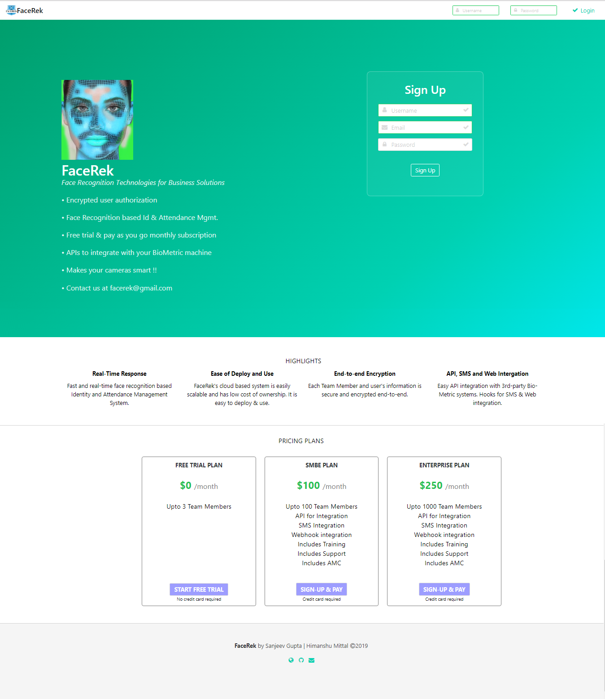
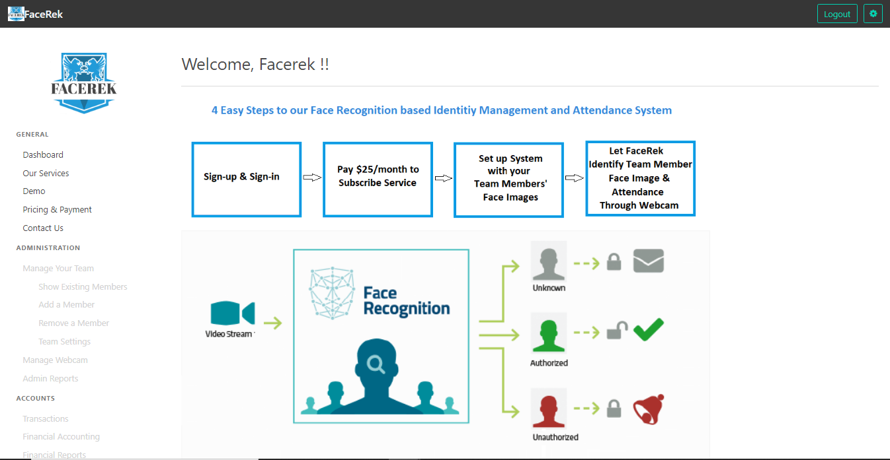
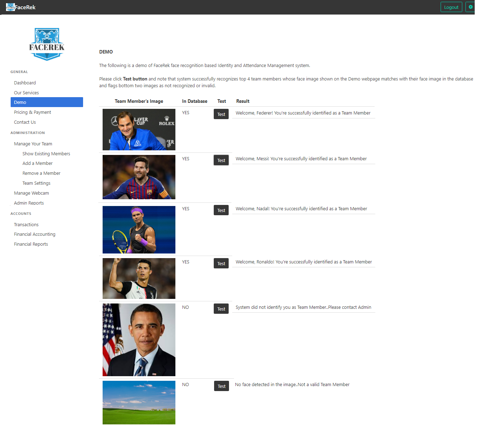
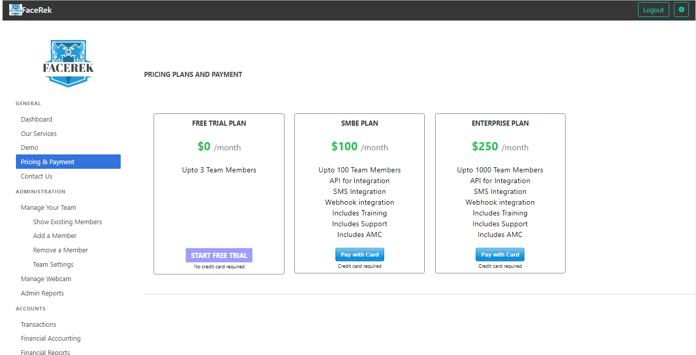

# Week5-Project
Midterm: Himanshu Mittal and Sanjeev Gupta

<b>FaceRek is a Face Recognition based Identity and Attendance Management system</b> 
• Scalable cloud based system wih low cost of ownership 
• Easy to deploy and use  
• Encrypted user authorization and access control 
• Free trial and pay-as-you-go monthly subscription (via Stripe or Paypal) offerings for SMBE or Enterprise clients 
• Easy to integrate with your BioMetric machine via FaceRek API interface 
• Webhooks and SMS integration 
• Makes your cameras smart !! 

Sample Screen Shots of FaceRek: 
  
  
  
  
